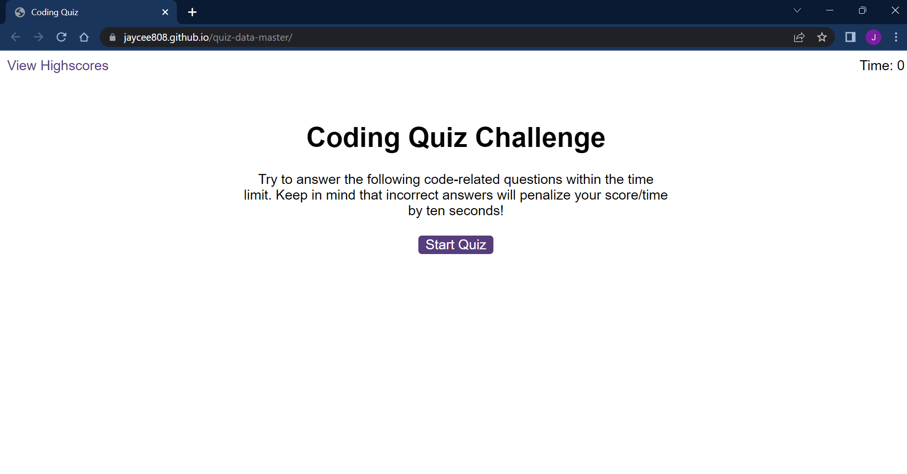

# Code Quiz

## Overview

This application was designed to present users with code-related questions. The application had to have a timer of 75 seconds and deduct time if the question was answered incorrectly.

## Screenshot

  

## Link to deployed site

https://jaycee808.github.io/quiz-data-master/